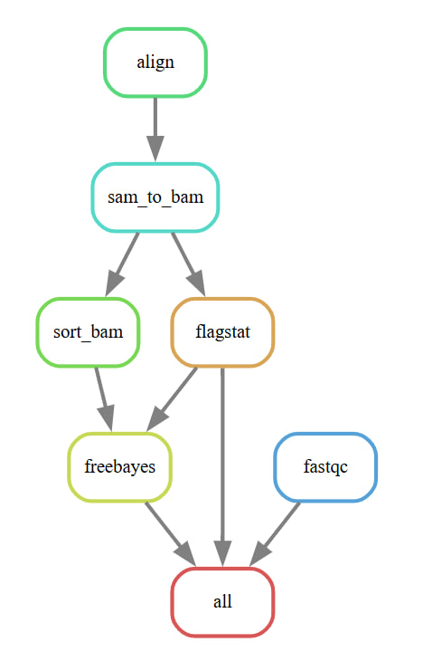

## Гончаров Матвей 22213
Вариант: Oxford Nanopore MinION/GridION/PromethION (ONT), minimap2, snakemake.
В качестве организма выбрал E.coli:
    https://trace.ncbi.nlm.nih.gov/Traces/?view=run_browser&acc=SRR33602302&display=metadata


### Скрипт на Bash
1. Для запуска скрипта на bash необходимо передать вначале файл с ридами, потом референсную последовательность.
```
bash bash.sh data/SRR33602302.fastq.gz data/ecoli_reference.fna
```

2. Результаты окажутся в папке "results_<дата и время запуска>"

### Snakemake "Hello, world!"
1. Для установки snakemake можно использовать pip.
```
pip install snakemake
```

2. Для работы с фреймворком нужно создать файл `snakemake`, в котором написать следующее:
```
rule all:
    input: "result.txt"  
rule generate_file:
    output: "result.txt"
    shell:
        """
        echo 'Этот файл создан Snakemake!' > {output}
        date >> {output}
        """
```

3. Чтобы запустить пайплайн в командой строке из папки, где лежит созданный snakemake файл пишем
```
snakemake -j 1
```
* Опция -j отвечает за кол-во используемых цпу ядер

### Snakemake pipeline
1. Конфигурация входа для пайплайна происходит в файле snakefile на первых его строках.

2. Результаты будут находится в папке  "snakemake_results_<дата и время запуска>"
* В stdout уходят логи + кастомные сообщения
* В snakemake_results<...>/pipeline-report.txt уходят кастомные сообщения
* В .snakemake/log/<дата и время> уходят логи 


3. DAG полученный с помощью фреймворка:



4. Благодаря использованию фремворка получилось автоматически распараллелить вычисления пайплайна. Например, утилиты `sort_bam` и `flagstat` могут исполнятся параллельно. Также при запуске на достаточном количестве ядер параллельно всем остальным утилитам исполняется fastqc.
