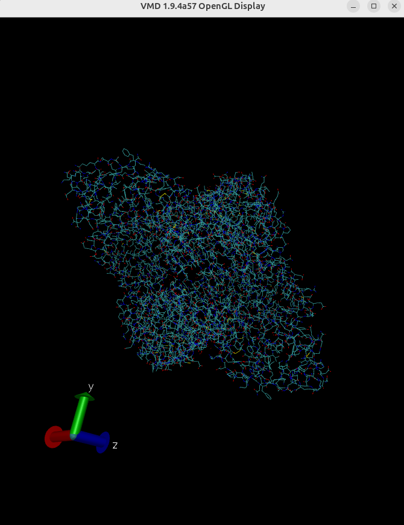
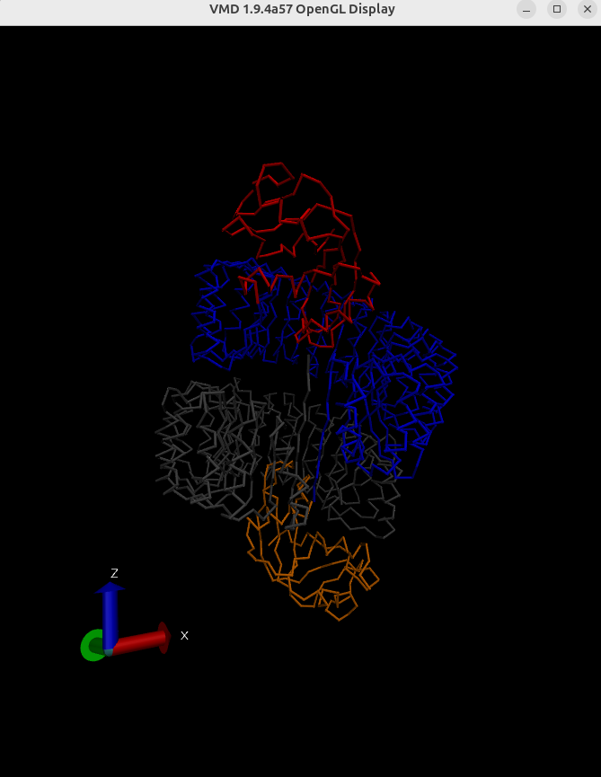
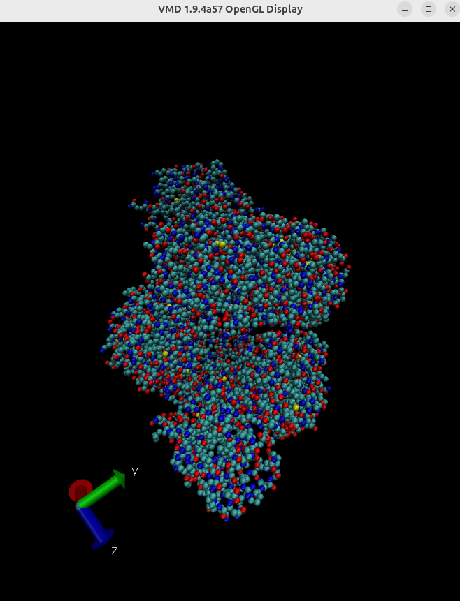
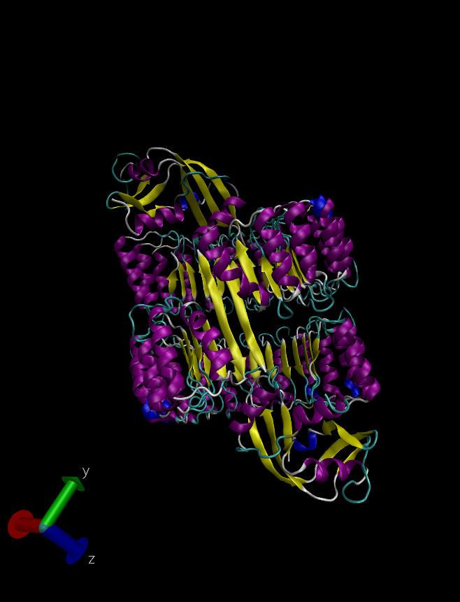
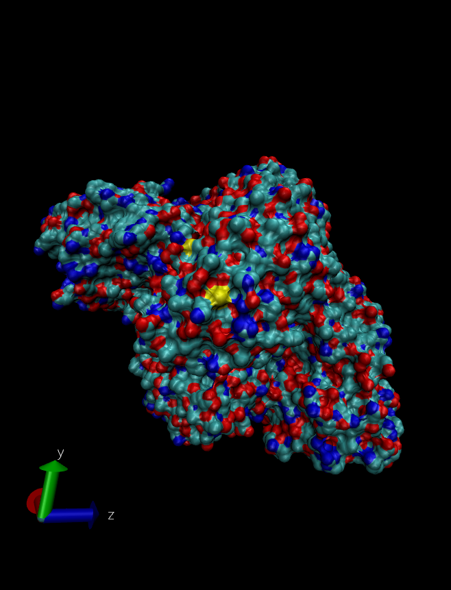
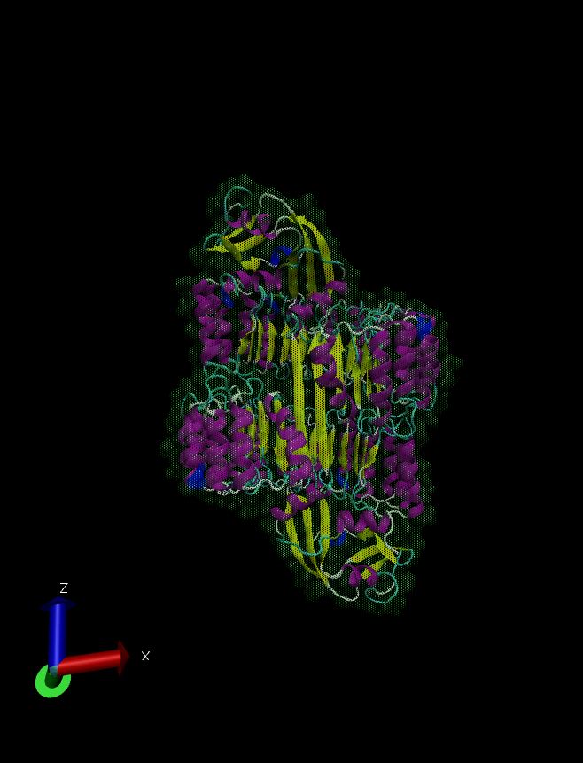
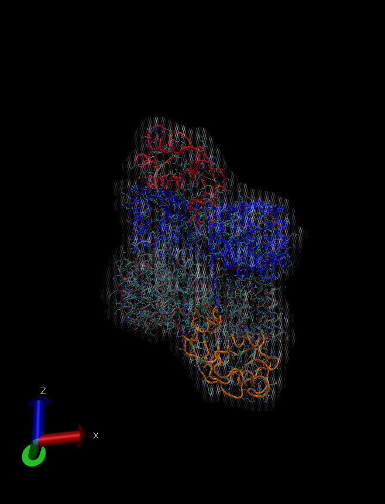

# Домашнее задание 4.

ПО - Visual Molecular Dynamics (VMD, http://www.ks.uiuc.edu/Research/vmd/)

Структура белка - https://www.rcsb.org/structure/1A4Y

# Визуализация структуры

Для изменения типа визуализации нужно воспользоваться меню Graphics.

## Wireframe
Режим `Lines`.

## Backbone и раскраска по доменам
Режим `Trace`.
Для отображения в backbone режиме нужно выбрать пункт backbone в selected atoms.

## Spacefill и раскраска CPK
Режим `CPK`.

## Ribbons 
Режим `NewCartoon`, метод раскраски - `SecondaryStructure`.

## Molecular surface
Режим `Surf`.

## Публикационное качество

