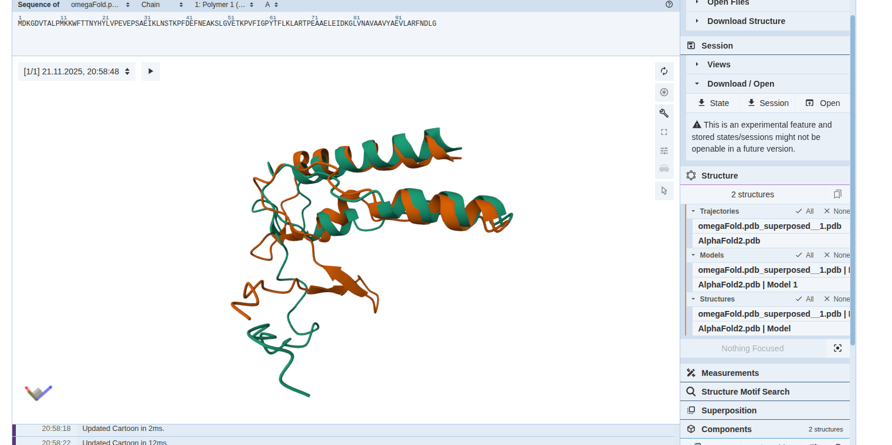

## Домашнее задание 5, Гончаров Матвей 22213

Последовательность
`MDKGDVTALPMKKWFTTNYHYLVPEVEPSAEIKLNSTKPFDEFNEAKSLGVETKPVFIGPYTFLKLARTPEAAELEIDKGLVNAVAAVYAEVLARFNDLG`

### Предсказываем структуру
1) AlphaFold2
Блокнот - [AlphaFold2.ipynb](AlphaFold2.ipynb).
Получили структуру AlphaFold2.pdb.

2) OmegaFold
Блокнот - [OmegaFold.ipynb](omegafold.ipynb).
Получили структуру OmegaFold.pdb.

### Выравниваем 
Программа выравниватель: `MMLigner`.

Запускаем выравнивание:

### Визуализируем выравнивание
Визуализируем в https://www.rcsb.org/3d-view/.
Сохраненная сессия - [session](mol-star_state_2025-11-21-20-58-48.molj).

Наблюдается хорошее совпадение предсказанных структур: основные α-спирали накладываются почти идеально, что указывает на согласованность двумя моделями. Отличия сосредоточены в гибких петлях и на концах цепи, что является ожидаемым для малоустойчивых участков. Также в одном из предсказаний не были сформированны b-листы.