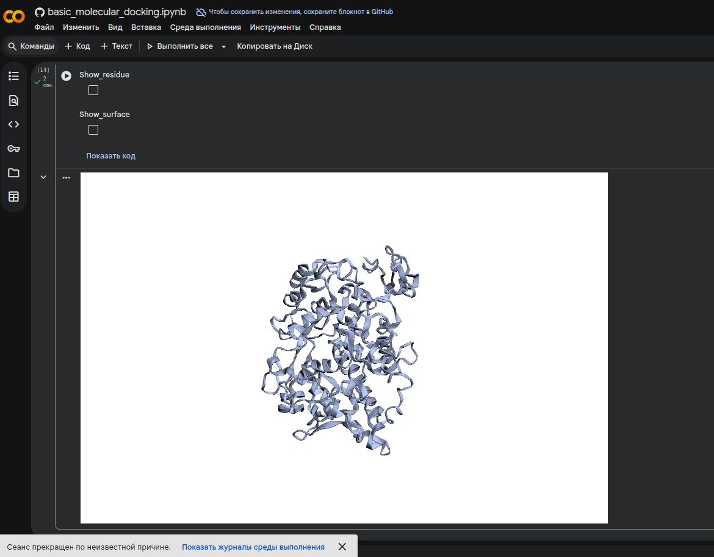
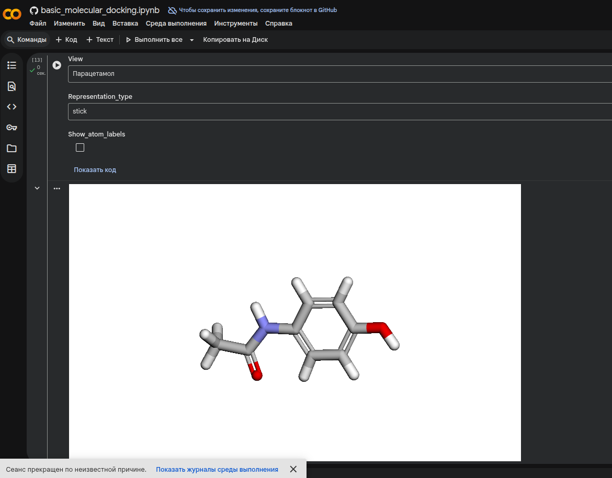
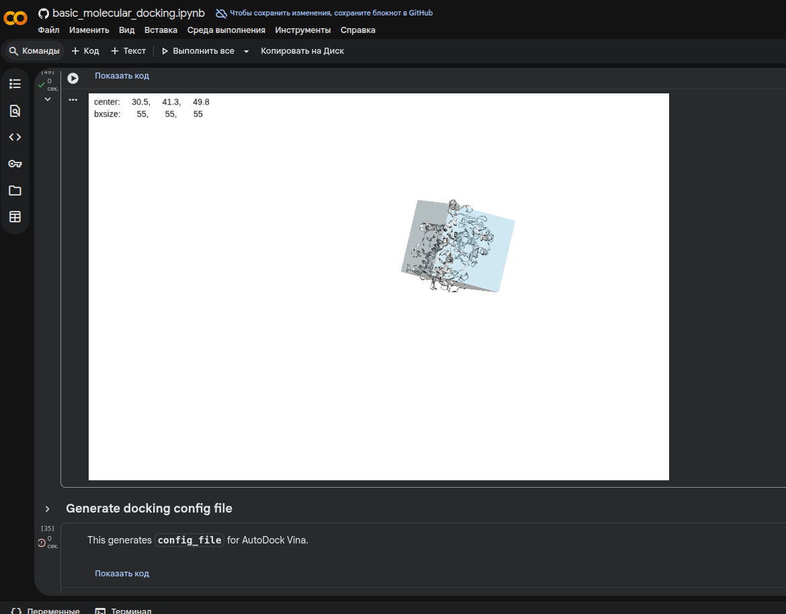
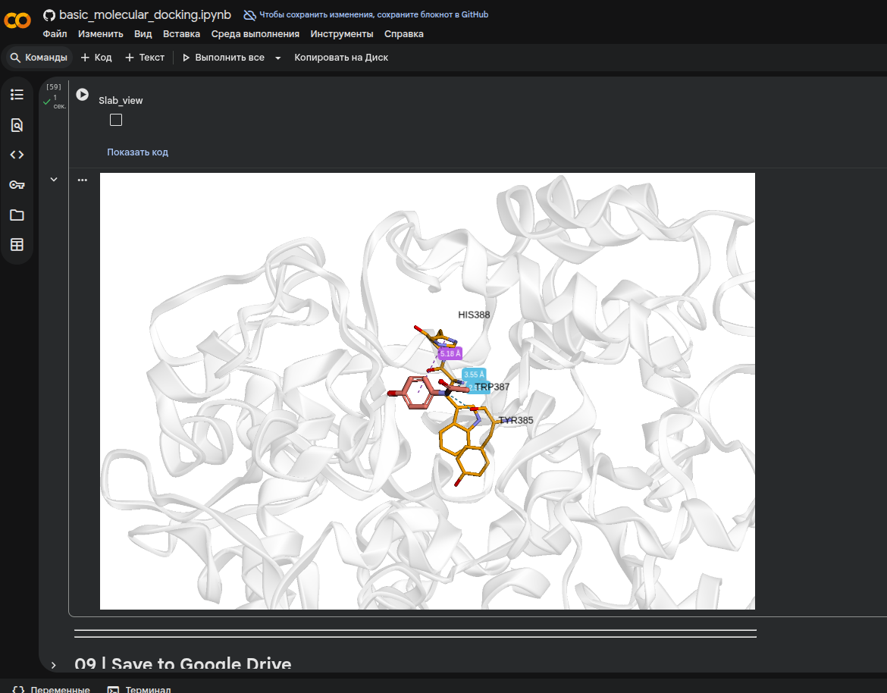
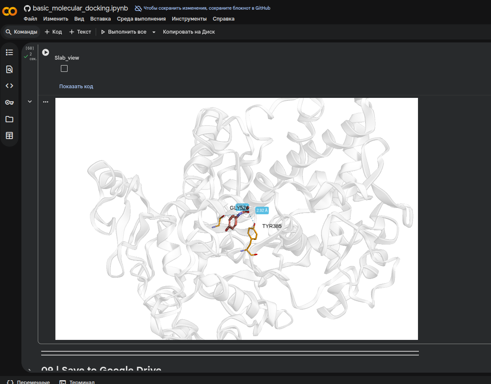

# Гончаров Матвей, 22213

* Лиганд - `Парацетамол` - `CC(=O)NC1=CC=C(O)C=C1`	
* Таргет - `Cyclooxygenase-2` -	`5F19`

## Задание 1
a. Действующее вещество
Парацетамол (ацетаминофен).

b. Область применения
жаропонижающее средство (при лихора дке),
обезболивающее средство при слабой и умеренной боли
(головная боль, зубная боль, миалгия, невралгия, боль при простуде и гриппе)

c. Молекулярный механизм действия (кратко)
Парацетамол подавляет активность фермента циклооксигеназы (преимущественно ЦОГ-2) в центральной нервной системе, снижая синтез простагландинов, участвующих в формировании боли и повышении температуры тела. Практически не оказывает противовоспалительного действия на периферии, так как в воспалённых тканях его эффект блокируется пероксидазной активностью.

## Задание 2
Для работы блокнота в google colab было необходимо было взять блокнот с development-branch репозитория и выставить версию среды выполнения 2025.07. 
```python
import sys
sys.version
```
Должен показать
```
3.11.13 (main, Jun  4 2025, 08:57:29) [GCC 11.4.0]
```


А также установить другие версии numpy и pandas. Все равно высветится ERROR и WARNING, но на неиспользующхися библиотеках.

```bash
pip uninstall -y numpy pandas scipy
pip install numpy==1.26.4 pandas==2.2.2 scipy==1.14.0 spyrmsd
```

Блокнот - `basic_molecular_docking.ipynb`.

## Задание 3
Лог докинга и некоторые полученные .pdb лежат в папке `artifacts`.

## Задание 4
### Трехмерная структура таргета:


### Трехмерная структура Лиганда:


### Бокс для докинга


### Докинг
Парацетамол_1

Парацетамол_5
